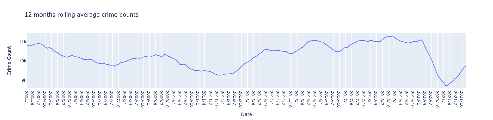
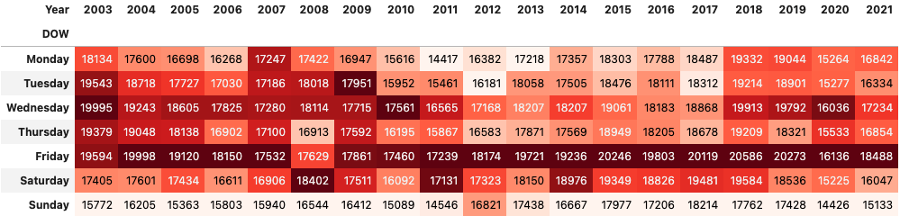
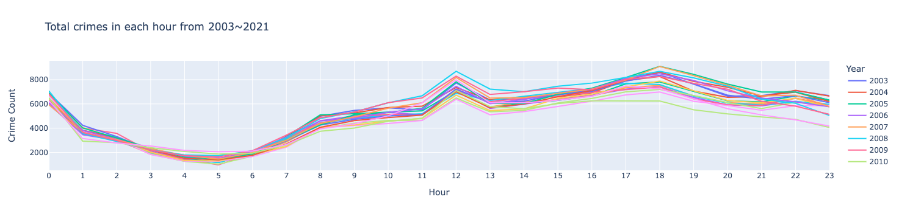
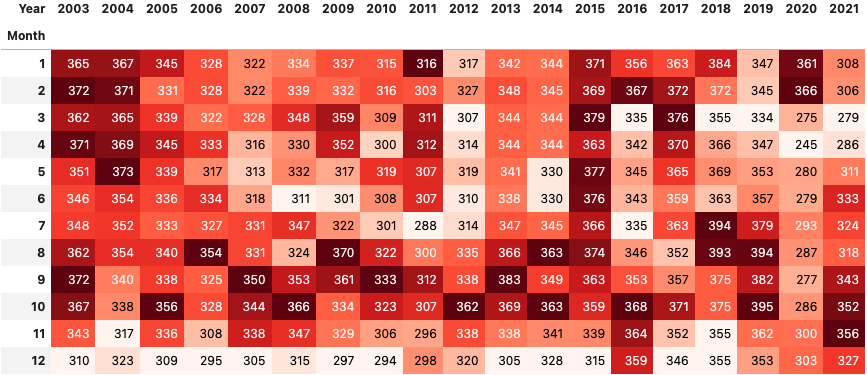
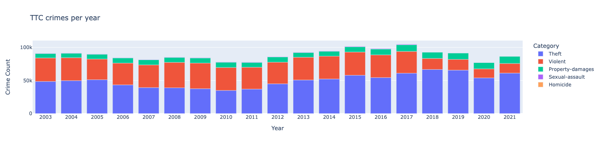
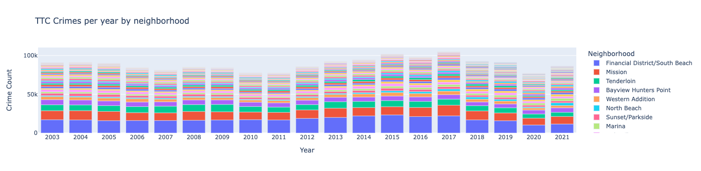
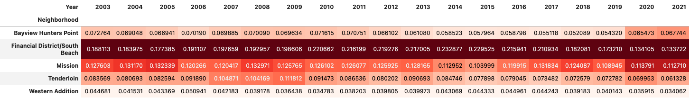
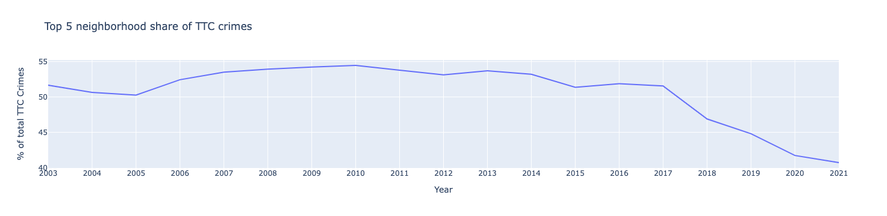

# San Francisco Crime Analysis 2003~2021

Photo by [Maarten van den Heuvel](https://unsplash.com/@mvdheuvel)

<!-- *3 min presentation of the project can be viewed [here](# TODO) -->

## Table of Contents
1. [Introduction](#introduction)

2. [Data preparation](#data-preparation)

3. [Exploratory Data Analysis](#exploratory-data-analysis)
    - [Trends of all crimes](#trends-of-all-crimes)
    - [When crimes occur](#when-crimes-occur)
    - [Threat to community (TTC) crimes](#threat-to-community-crimes)
    - [TTC crimes in the top 5 neighborhoods](#ttc-crimes-in-the-top-5-neighborhoods)

4. [Conclusion and future works](#conclusion-and-future-works)

- [Built with](#built-with)
- [Author](#author)

---

## Introduction

San Francisco is my hometown. I've spent most of my life in this beautiful city, and it will always be an essential part of my life. As with any major city in the world, crimes are always an issue for the community, and San Francisco is no exception. I've noticed that many of my friends in San Francisco claim that crimes have increased recently. I wanted to see if these claims are valid by analyzing the data. I also hope my analysis can give policymakers and law enforcement insight into allocating most in need resources.

---

## Data preparation

I've extracted incident report data from 2003 to the present from the San Francisco Police Department (SFPD). SFPD updated the way they collected data in 2018. So the data is divided into two parts: [2003 to 2018](https://data.sfgov.org/Public-Safety/Police-Department-Incident-Reports-Historical-2003/tmnf-yvry) and [2018 to current](https://data.sfgov.org/Public-Safety/Police-Department-Incident-Reports-2018-to-Present/wg3w-h783). According to SFPD, the data are filed by officers or self-reported by members of the public using SFPD's online reporting system. Data is added once incident reports have been reviewed and approved by a supervising Sergeant or Lieutenant. This data is the most comprehensive data to get the numbers of police incident reports in San Francisco, and by analyzing this data, we can get the trend of crimes in this city.

The number of unique incidents from 2003 to the present was 2,665,568 (as of April 20, 2022). Since 2022 is still ongoing, I decided to remove it and analyze the data from 2003 to 2021. I also removed non-crime incidents and ones that were missing police district info. There were also 81 different types of incidents. I categorized them into 10 different incident types; prostitution, drug, fraud, property damages, traffic collision, theft, sexual assault, violence, homicide, and others.

After cleaning the data, I ended up with **2,345,500 rows (incidents) and 12 columns**

---

## Exploratory Data Analysis

### Trends of all crimes

I began by analyzing the general trends of all crimes. It seems like crimes were on a downward trend from 2004 until mid-2012 (Fig 1). Crimes have been upward from mid-2012 through early 2020 until the pandemic. As San Francisco loosened up lockdowns in 2021, crimes have been increasing again. As for the type of incidents, we can see that theft is the most common crime (Fig 2). The "Other" category consists of 31 different types that include suspicious, miscellaneous, missing person, suicide, etc.

<b>Fig 1.</b> 12 months rolling average crimes from 2004~2021

&nbsp;

<b>Fig 2.</b> Incident types occurred in San Francisco from 2003~2021

| Categories        | Incident counts (2003~2021)  |
| ----------------- | ---------------------------: |
| Theft             | 948,990                      |
| Violent           | 578,268                      |
| Others            | 423,072                      |
| Property-damages  | 155,077                      |
| Drug              | 129,210                      |
| Fraud             | 82,878                       |
| Prostitution      | 17,473                       |
| Sexual-assault    | 9,246                        |
| Traffic-collision | 1,221                        |
| Homicide          | 65                           |
&nbsp;

### When crimes occur

I wanted to see precisely when crimes were happening. So I analyzed crimes in the day of the week, time of day, and month. By looking at the data for these criteria, I realized that crimes occur when people are out on the streets. Many people go out on Fridays (Fig 3) or 12 pm and 6 pm for lunch or leaving work (Fig 4), so it makes sense that crimes occur more during these times. There isn't a consistent month with more crime than others, but December usually had fewer crimes than other months (Fig 5). December may have had fewer crimes because many people are on holiday during this time, and hence there are fewer people out in the streets.

<b>Fig 3.</b> Annual crimes per day of the week from 2003~2021

&nbsp;

<b>Fig 4.</b> Total crimes in each hour from 2003~2021

&nbsp;

<b>Fig 5.</b> The average number of crimes per day for each month from 2003~2021

&nbsp;

### Threat to community crimes

I wanted to analyze if "threat to community" (TTC) crimes increased in San Francisco. It's the type of crime that frightens people, so I wanted to narrow my analysis criteria to these categories. I consider TTC crimes in the crime category of theft, violence, property damages, sexual assault, and homicide. I focused on these categories because these crimes affect the people and community. We can see that TTC crimes decreased from 2003 until 2011 and have been on an upward trend through 2017 (Fig 6). We probably saw a dip in 2018 because SFPD changed how they collect its data this year. TTC crimes fell in 2020 during the pandemic, and they increased in 2021 as San Francisco loosened up lockdowns.

I was also curious to know the effects of [Proposition 47](https://www.courts.ca.gov/prop47.htm), which passed in 2014 as a California ballot initiative, under which theft of less than $950 in goods is treated as a nonviolent misdemeanor and rarely prosecuted. Many [articles](https://www.wsj.com/articles/san-francisco-shoplifters-theft-walgreens-decriminalized-11634678239) point out that theft has increased ever since California passed this law. We can observe that theft decreased from 2005~2010 and started to grow in 2011. Ever since Proposition 47 passed in 2014, the number of theft crimes has been upward. Critiques will argue that this law has made our streets less safe. However, TTC crimes decreased in 2016 and haven't reached 2017 levels ever since, and we see fewer violent crimes. We don't know if these results were the direct effects of Proposition 47, and it is debatable if this law made the streets of San Francisco less safe or not.

<b>Fig 6.</b> TTC crimes from 2003-2021

&nbsp;

### TTC crimes in the top 5 neighborhoods

The downtown area of "Financial District/South Beach" had the highest TTC crimes of all neighborhoods (Fig 7). From 2003 to 2019, this neighborhood was responsible for about 17~23% of all TTC crimes in San Francisco (Fig 8). This number has dropped to 13% in 2020 and 2021 due to the pandemic. As more people work from home, fewer people are in downtown; hence, fewer crimes. The top 5 neighborhoods for TTC crimes have always been "Financial District/South Beach," "Mission," "Tenderloin," "Bayview Hunters Point," and "Western Addition ." From 2003 to 2017, the top 5 neighborhoods were responsible for more than 50% of TTC crimes in San Francisco (Fig 9). That rate has steadily decreased since 2018, and it is now at the lowest point at around 40%. Since the overall TTC crimes increased in 2021, but the top 5 neighborhoods decreased, we can imply that TTC crimes have been scattered to other neighborhoods.

<b>Fig 7.</b> TTC crimes from 2003~2021 by neighborhood

&nbsp;

<b>Fig 8.</b> The proportion of TTC crimes from 2003~2021 in the top 5 neighborhoods

&nbsp;

<b>Fig 9.</b> The ratio of TTC crimes from 2003~2021 in the top 5 neighborhoods (aggregated)

&nbsp;

---

## Conclusion and future works

My biggest takeaway is that crimes occur when people are out on the streets. Overall, crime has increased in San Francisco recently, but not compared to pre-pandemic levels in 2017~2019. Crimes are more scattered around San Francisco now compared to 2019, and this can be part of the reason why some people claim that San Francisco's crimes are increasing.

One of the biggest challenges for this analysis was data cleaning. Since there are many missing values for police reports, it was difficult to get accurate neighborhoods where crimes occurred. There were 81 different types of incidents, and I had to create a rule to narrow them down to 10. When the neighborhoods were not listed in the incident report, I used the police district, which is much vaguer in identifying the location.

For future works, I want to map out the exact location of crimes, incorporate the crimes per capita metric of 100,000 people, and add events data of San Francisco. There are longitude and latitude coordinates in the data, so I can plot them out nicely and see if there is a specific block where crimes occur the most. The crimes per capita metric of 100,000 people are frequently used to compare crime rates among different countries. I want to see if the crimes per capita have changed in San Francisco throughout the years. By adding events data to this analysis, I can check if there’s a correlation with increases in crime when events occur.

---

## Built With

* **Software Packages:**  [Python](https://www.python.org/),  [Pandas](https://pandas.pydata.org/docs/), [Numpy](https://numpy.org/),  [Matplotlib](https://matplotlib.org/), [Seaborn](https://seaborn.pydata.org/), [Plotly](https://plotly.com/)
## Author

* **Takeshi Sugiyama** - *Data Scientist*
  * [Linkedin](https://www.linkedin.com/in/takeshi-sugiyama/)
  * [Tableau](https://public.tableau.com/profile/takeshi.sugiyama)